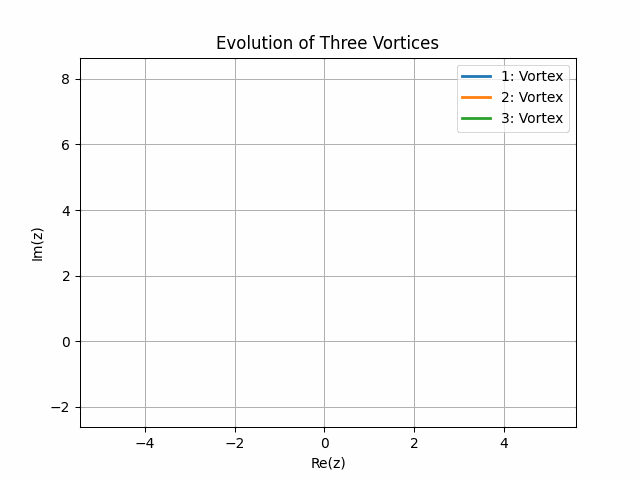
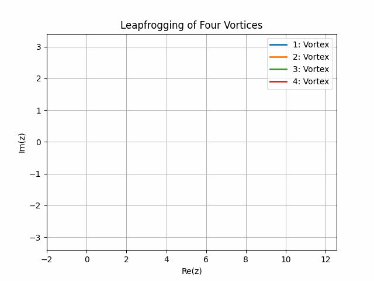
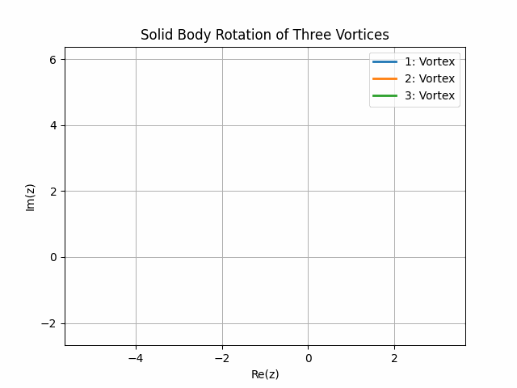

***************
Getting Started
***************

Description
###########

This python project uses `potential flow <https://en.wikipedia.org/wiki/Potential_flow>`_ theory to simulate the displacement of flow elements.
The equations of motions of the flow elements are solved numerically to obtain a dynamic representation of the flow. 
The elements below may be added to the flow: 

* a uniform stream,
* a source,
* a vortex,
* a cylinder,
* a Joukowski element,
* a wall.

Figures
#######

Prerequisites
#############

This project requires the following installed on your machine to run:

* `python <https://www.python.org/>`_ ^3.0.0 programming language,
* `pip <https://pip.pypa.io/en/stable/>`_ ^22.0.0, python's package manager,
* `GNU Make <https://www.gnu.org/software/make/>`_
  
Check your installation and follow the installation steps in the respective documentations if any of these dependencies is not installed.

.. code-block:: console

    $ python3 --version
    $ pip --version
    $ make --version

Installation
############

To use this project on your machine, start by cloning the repo from github. Cd into the project's root and install the dependencies.

.. code-block:: console
    
    $ git clone https://github.com/Niceural/wolfex.git
    $ cd wolfex
    $ make init

License
#######

This project is distributed under the MIT License, it's all yours :).

Contact
#######

Nicolas Bayle 

* `@Niceural <https://twitter.com/Niceural>`_
* `LinkedIn <https://www.linkedin.com/in/nicolas-bayle-558a21200>`_
* nicolas.bayle20@imperial.ac.uk

Acknowledgment
##############

This project is the result of an internship carried out at the `Institut de Mecanique des Fluides de Toulouse (IMFT) <https://www.imft.fr/en/accueil-english/>`_. 
Special thanks go to the IMFT and more importantly to `Christophe Airiau <https://www.imft.fr/en/personal-page/airiau-christophe-en/>`_ (`LinkedIn <https://www.linkedin.com/in/airiau-christophe-a4791072/>`_) for this internship opportunity.

Disclaimer
##########

This project is intended for education purposes and should not be used for production.
The user should be aware that this project may not behave as expect for parameters inputs it has not been programmed to take.