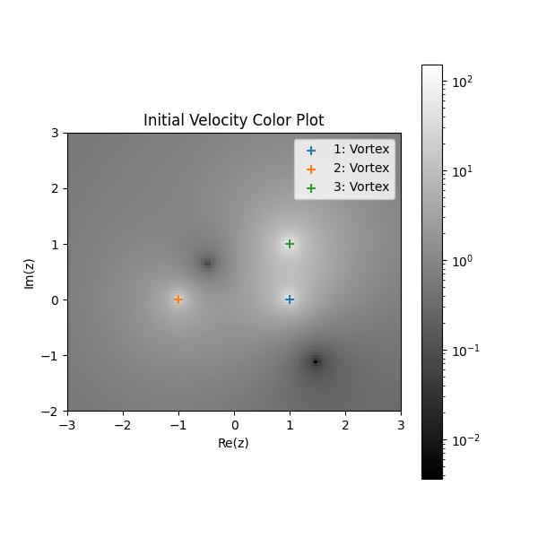
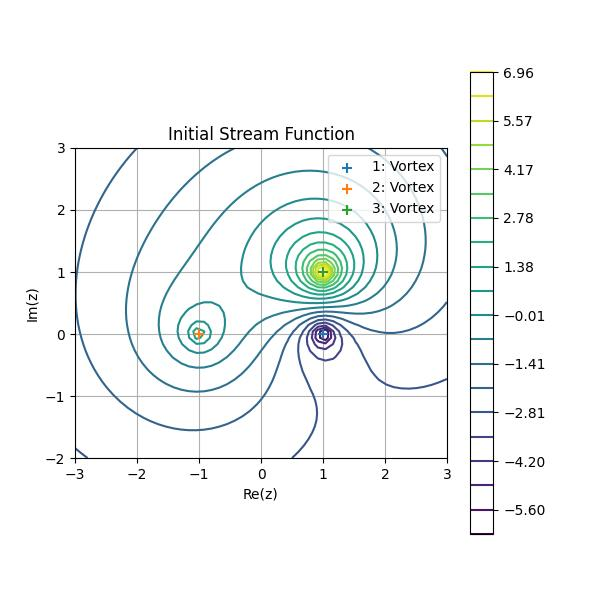
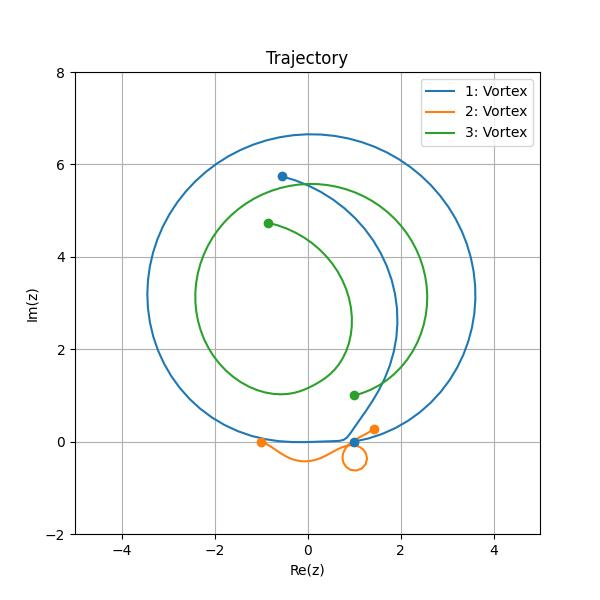
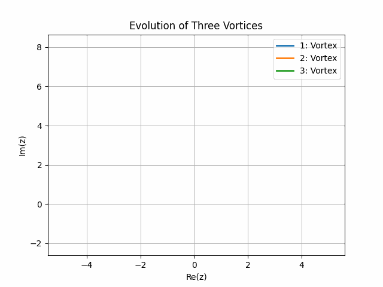

.. _usage:

*****
Usage
*****

This project can be used for two main purposes:

* to visualize static flow, e.g. the velocity distribution over a circular cylinder,
* to solve the flow equations and visualize the trajectory of flow elements, e.g. three vortices in a free stream. 

The latter is simply an extension of the former.
In this section we will learn how to use this project's API to run our own simulations.

For the sake of this example, let us consider the case of three vortices of different position and circulation.
This simulation corresponds to :mod:`example3` and will be referred to as `example3`.
The three vortices will have the following parameters:

+-----------+-------------+-------------+--------------+
|           | x position  | y position  | Circulation  |
+===========+=============+=============+==============+
| Vortex 1  | 1.0         | 0.0         | -12.57       |
+-----------+-------------+-------------+--------------+
| Vortex 2  | -1.0        | 0.0         | 6.28         |
+-----------+-------------+-------------+--------------+
| Vortex 3  | 1.0         | 1.0         | 18.85        |
+-----------+-------------+-------------+--------------+

Declaring the flow elements
###########################

We start off by creating the simulation directory. 
This directory contains the flow elements declaration and the output data.
It can be located at any location accessible by the user on your local device.
We suggest you put it under the project's root in the `data/` folder.
We are also going to need a file to declare the flow elements so let's create it now.
From the project's root, create a new directory `example3` and a new file `flow_elements.csv` in the newly created directory.

.. code-block:: console

    $ mkdir ./data/example3/
    $ touch ./data/example3/flow_elements.csv

Open the `flow_elements.csv` file in your text editor.
This file declares the flow elements, each line corresponding to one element.
Each line must start with a character representing the element such as '`v`' for vortex.
The element's parameters are separated by a comma as the file extension would suggest. 
A guide to adding a flow element is presented below

* a uniform stream is represented by character '`u`' and takes two parameters: a free stream velocity and a free stream incidence with x-axis in degrees.
  For instance, the line below adds a uniform stream with velocity 30 m/s and at a 20 degrees incidence::

    u, 30.0, 20.0

* a source is represented by character '`s`' and takes three parameters: a strength, a x coordinate, and a y coordinate. 
  For instance, the line below adds a source of strength 10, x and y coordinates 1 and 2 respectively::

    s, 10.0, 1.0, 2.0

* a vortex is represented by character '`v`' and takes three parameters: a circulation, a x coordinate, and a y coordinate. 
  For instance, the line below adds a vortex of circulation 10, x and y coordinates 1 and 2 respectively::

    v, 10.0, 1.0, 2.0

* a cylinder is represented by character '`c`' and takes six parameters:

  1. a x position,
  2. a y position,
  3. a circulation,
  4. a radius,
  5. a free stream velocity,
  6. a free stream angle of incidence with x-axis, in degrees.

  For instance, the line below adds a cylinder of position (0.0, 0.0), circulation 7.0, radius 1.0, velocity 10.0 and incidence 0.0 degrees::

    c, 0.0,  0.0, 7.0, 1.0, 10.0, 0.0

* a wall is represented by character '`w`'. 
  A vertical wall takes two parameters: a first value set to `inf` and a second value corresponding to the x position of the wall.
  Non vertical walls can be added by specifying two parameters: the slope and the intercept of the linear function defining the wall.
  For instance, the two lines below add a vertical wall at `x = 3` and another wall of equation `y = 2x - 4`::

    w, inf, 3.0
    w, 2.0, -4.0

In our case, add the following three lines to the `flow_elements.csv` file:

::

  v,  1.0,  0.0,  -12.5664
  v, -1.0,  0.0,    6.2832
  v,  1.0,  1.0,   18.8496

Creating the `main` script
##########################

Now that we've declared what elements we want in our flow, the next step is to create and populate the `main` script which is responsible for making the function calls.
We suggest you create this file  in the `./examples/ <../../examples/>`_ directory:

.. code-block:: console

  $ touch ./wolfex/example3.py

For this example, the `./wolfex/example3.py <../../wolfex/example3.py>`_ file has the following implementation.
You can copy and paste the code.

.. literalinclude:: ../../wolfex/example3.py
  :linenos:
  :language: python
  :lines: 25-62

The first few lines import the dependencies.

Reading the `flow_elements.csv <https://github.com/Niceural/wolfex/blob/b0a191a1609e523939e9298d0dbe72aa059cba22/data/example3/flow_elements.csv>`_ file
########################################################################################################################################################

The next step is to construct the :class:`wolfex.flow_element.FlowElement` instances and add them to the :class:`wolfex.flow_element.Flow` instance.
This is done by the :func:`wolfex.utils.read_flow_elements_file` function.
This function reads a file line by line and parses its content to construct the :class:`wolfex.flow_element.FlowElement` instances.
Call this function on our parameters file and store the instance of :class:`wolfex.flow_elements.Flow` returned.

Plotting the initial conditions
###############################

The next step is to plot the initial flow condition.
Four different plots can be created:

1. :func:`wolfex.plot.velocity_stream_lines`, a matplotlib streamline plot of the velocity,
2. :func:`wolfex.plot.velocity_colorplot`, a color plot of the velocity,
3. :func:`wolfex.velocity_potential`, a contour plot of the velocity potential,
4. :func:`wolfex.stream_function`, a contour plot of the steam function.

Here are some examples of the plots you may obtain for this example.

Solving the flow equations
##########################

The flow equations can be solved by calling the :func:`wolfex.utils.solve_velocity_ode` function.
An optional argument, `video_folder`, can be passed. This will result in the :func:`wolfex.plot.velocity_stream_lines` function being called at each iteration.
The plots can then be combined by the :func:`wolfex.plot.from_dir_to_video` function to produce a video file.

Plotting the trajectory
#######################

Three plots can be created to visualize the trajectory of the elements:

1. :func:`wolfex.plot.trajectory`, a simple line plot of the element's trajectory,
2. :func:`wolfex.plot.animated_trajectory`, an animation of the element's trajectory,
3. :func:`wolfex.plot.from_dir_to_video`, a function to combine all plots in a directory and produce a video.

Here are some examples of the plots you may obtain for this example.

