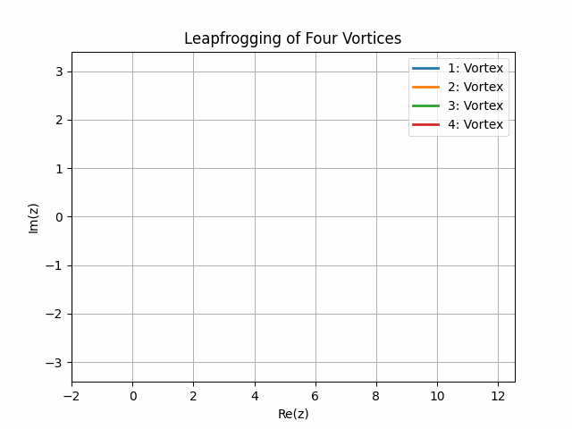
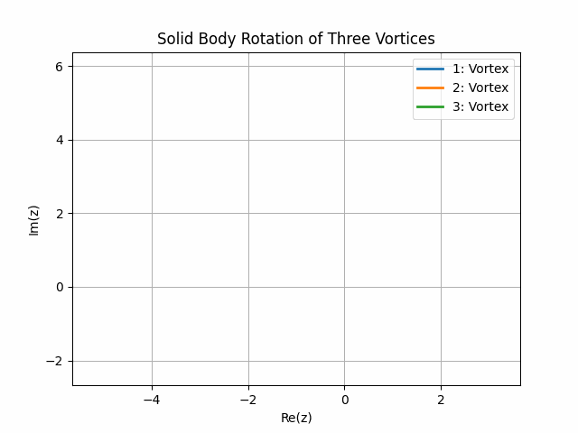
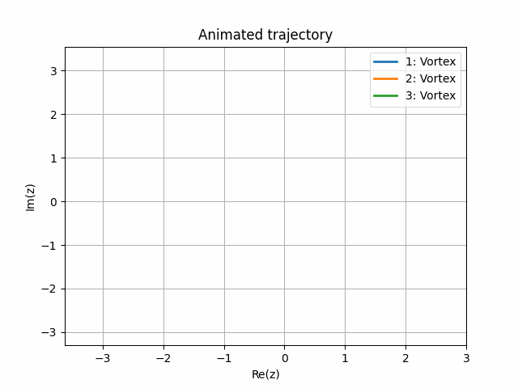
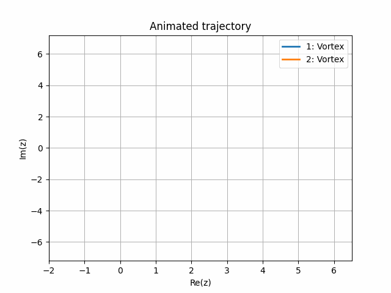
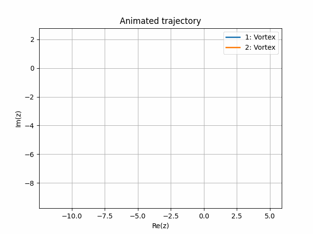

********
Examples
********

In this section you will learn how to run the pre-defined examples. 
For more information on how to configure this project and run the code for your own cases, see :ref:`usage`.

Example 1: Pair of Counter Rotating Vortices
############################################

In this example we will simulate a pair of counter-rotating vortices.
The flow elements are presented in the table below.
To run this example enter the following command in your terminal in the project root: 

.. code-block:: console

    $ make example1

+-----------+-------------+-------------+--------------+
|           | x position  | y position  | Circulation  |
+===========+=============+=============+==============+
| Vortex 1  | 0.0         | 0.5         | 6.3          |
+-----------+-------------+-------------+--------------+
| Vortex 2  | 0.0         | -0.5        | -6.3         |
+-----------+-------------+-------------+--------------+

Example 2: Pair of Co-Rotating Vortices
#######################################

In this example we will simulate a pair of co-rotating vortices.
The flow elements are presented in the table below.
To run this example enter the following command in your terminal in the project root: 

.. code-block:: console

    $ make example2

+-----------+-------------+-------------+--------------+
|           | x position  | y position  | Circulation  |
+===========+=============+=============+==============+
| Vortex 1  | 0.0         | 0.5         | 6.3          |
+-----------+-------------+-------------+--------------+
| Vortex 2  | 0.0         | -0.5        | 6.3          |
+-----------+-------------+-------------+--------------+

Example 3: Evolution of Three Point Vortices
############################################

In this example we will simulate three vortices.
The parameters are presented in the table below.
To run this example enter the following command in your terminal in the project root: 

.. code-block:: console

    $ make example3

+-----------+-------------+-------------+--------------+
|           | x position  | y position  | Circulation  |
+===========+=============+=============+==============+
| Vortex 1  | 1.0         | 0.0         | -12.57       |
+-----------+-------------+-------------+--------------+
| Vortex 2  | -1.0        | 0.0         | 6.28         |
+-----------+-------------+-------------+--------------+
| Vortex 3  | 1.0         | 1.0         | 18.85        |
+-----------+-------------+-------------+--------------+

.. image:: ./image/traj_ex3.gif

Example 4: Leapfrogging of Four Vortices
########################################

In this example we will simulate a case of leapfrogging of four vortices.
The parameters are presented in the table below.
To run this example enter the following command in your terminal in the project root: 

.. code-block:: console

    $ make example4

+-----------+-------------+-------------+--------------+
|           | x position  | y position  | Circulation  |
+===========+=============+=============+==============+
| Vortex 1  | 0.0         | 1.0         | 6.28         |
+-----------+-------------+-------------+--------------+
| Vortex 2  | 0.0         | -1.0        | -6.28        |
+-----------+-------------+-------------+--------------+
| Vortex 3  | 1.0         | 1.0         | 6.28         |
+-----------+-------------+-------------+--------------+
| Vortex 4  | 1.0         | -1.0        | -6.28        |
+-----------+-------------+-------------+--------------+

Example 5: Solid Body Rotation of Three Vortices
################################################

In this example we will simulate the solid body rotation of three vortices.
The parameters are presented in the table below.
To run this example enter the following command in your terminal in the project root: 

.. code-block:: console

    $ make example5

+-----------+-------------+-------------+--------------+
|           | x position  | y position  | Circulation  |
+===========+=============+=============+==============+
| Vortex 1  | 1.0         | 0.0         | -6.28        |
+-----------+-------------+-------------+--------------+
| Vortex 2  | -1.0        | 0.0         | 6.28         |
+-----------+-------------+-------------+--------------+
| Vortex 3  | 0.0         | 1.73        | 12.57        |
+-----------+-------------+-------------+--------------+

Example 6: Collapse of Three Vortices
###############################################

In this example we will simulate the collapse of three vortices
The parameters are presented in the table below.
To run this example enter the following command in your terminal in the project root: 

.. code-block:: console

    $ make example6

+-----------+-------------+-------------+--------------+
|           | x position  | y position  | Circulation  |
+===========+=============+=============+==============+
| Vortex 1  | -1.0        | 0.0         | 12.57        |
+-----------+-------------+-------------+--------------+
| Vortex 2  | 1.0         | 0.0         | 12.57        |
+-----------+-------------+-------------+--------------+
| Vortex 3  | 1.0         | 1.41        | -6.28        |
+-----------+-------------+-------------+--------------+

Example 7: Circular Cylinder
############################

In this example we will show the plots for a circular cylinder
The parameters are presented in the table below.
To run this example enter the following command in your terminal in the project root: 

.. code-block:: console

    $ make example7

+-------------+-------------+-------------+--------------+---------+-----------+------------+
|             | x position  | y position  | Circulation  | Radius  | Velocity  | Incidence  |
+=============+=============+=============+==============+=========+===========+============+
| Cylinder 1  | 0.0         | 0.0         | 12.57        | 1.0     | 10.0      | 0.0        |
+-------------+-------------+-------------+--------------+---------+-----------+------------+

Example 8: Joukowski Aerofoil
#############################

In this example we will visualize a Joukowski aerofoil
Please note that the :class:`flow_element.JoukowskiElement` has not been checked for correctness.
To run this example enter the following command in your terminal in the project root: 

.. code-block:: console

    $ make example8

Example 9: Pair of Counter Rotating Vortices with Vertical Wall
###############################################################

In this example we will simulate a pair of counter-rotating vortices with a vertical wall at :math:`x = 5`.
The parameters are presented in the table below.
To run this example enter the following command in your terminal in the project root: 

.. code-block:: console

    $ make example9

+-----------+-------------+-------------+--------------+
|           | x position  | y position  | Circulation  |
+===========+=============+=============+==============+
| Vortex 1  | 0.0         | 0.5         | 6.3          |
+-----------+-------------+-------------+--------------+
| Vortex 2  | 0.0         | -0.5        | -6.3         |
+-----------+-------------+-------------+--------------+

Example 10: Pair of Counter Rotating Vortices with Two Walls
############################################################

In this example we will simulate a pair of counter-rotating vortices.
Two walls are added to the flow: a vertical wall at :math:`x = 4` and a horizontal wall at :math:`y = 1`.
The parameters are presented in the table below.
To run this example enter the following command in your terminal in the project root: 

.. code-block:: console

    $ make example10

+-----------+-------------+-------------+--------------+
|           | x position  | y position  | Circulation  |
+===========+=============+=============+==============+
| Vortex 1  | 0.0         | 0.5         | 6.3          |
+-----------+-------------+-------------+--------------+
| Vortex 2  | 0.0         | -0.5        | -6.3         |
+-----------+-------------+-------------+--------------+

